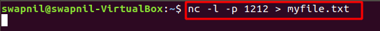

# Task 1

### 1. Connecting & Listening To UDP Port

* On Client Side Run 

```text
netcat -u <target-ip> 2468
```


* On Server Side Run

```text
netcat -u -l -p 2468
```


* We can observe the network connection using netstat

```text
netstat | grep 2468
```


### 2. Connecting & Listening To TCP Port

* On Client Side Run 

```text
netcat -u <target-ip> 1357
```


* On Server Side Run


* We can observe the network connection using netstat

```text
netstat | grep 2468
```


### 3. Transferring Files with Netcat

* On client side run

```text
nc <target_ip> <port> < file_name
```


* On Server Side Run

```text
nc -l -p <port> file_name
```



* Can view the file on the target


### 

