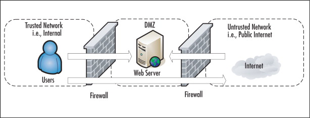
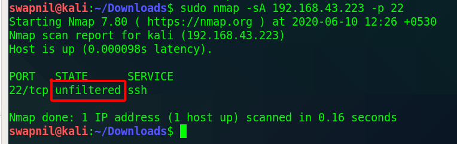
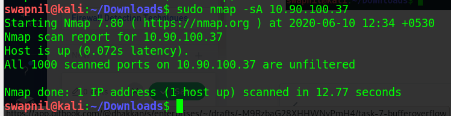
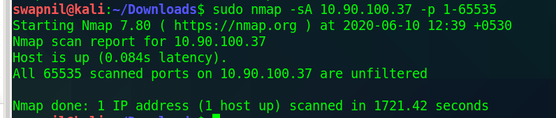
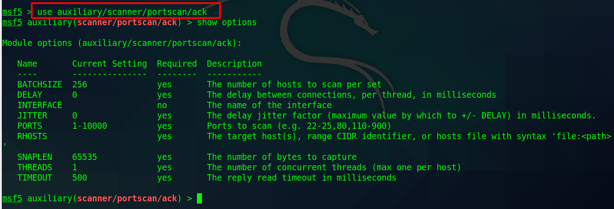
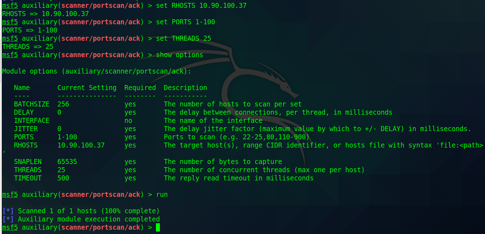
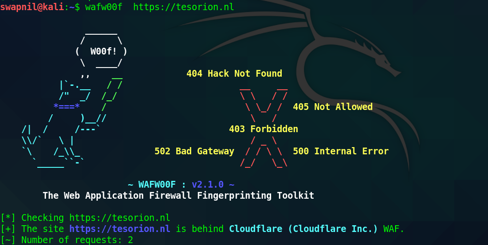
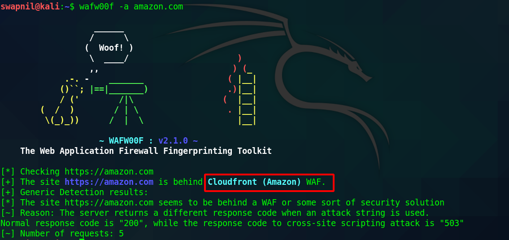

# Firewall Detection Techniques

### What is Firewall ?

A firewall is a software or hardware device that inspects incoming and outgoing traffic on a network. Based on a predetermined set of policies and rules, or an access control list \(ACL\), the firewall filters and restricts all connections that do not abide by those rules. The main purpose of a firewall is to separate trusted networks from the external network or the internet.



One helpful feature of the TCP protocol is that systems are required by [RFC 793](http://www.rfc-editor.org/rfc/rfc793.txt) to send a negative response to unexpected connection requests in the form of a TCP RST \(reset\) packet. The RST packet makes closed ports easy for Nmap to recognize. Filtering devices such as firewalls, on the other hand, tend to drop packets destined for disallowed ports. In some cases they send ICMP error messages \(usually port unreachable\) instead. Because dropped packets and ICMP errors are easily distinguishable from RST packets, Nmap can reliably detect filtered TCP ports from open or closed ones, and it does so automatically

## Firewall identification with Nmap

Nmap has a streamlined firewall filtering identification function that can be used to identify filtering on ports based on ACK probe responses. This function can be used to test a single port or multiple ports in sequence to determine filtering status.

To use Nmap to perform firewall identification, we will need to have a remote system that is running network services.

**These steps help to identify firewall using nmap:**

* To perform an Nmap firewall ACK scan, nmap should be called with the IP address specification, the destination port, and the -sA option:

```text
nmap -sA <ip> -p <port>
```



* On performing this scan on the Metasploitable2 system in my local network without routing the traffic through a firewall, the response indicates that the TCP port 22 \(SSH\) is unfiltered. A port-filtering assessment can be made on Nmap's 1,000 common ports by performing the same scan without providing a port specification:



* When performed against the Metasploitable2 system on the local network that is not sitting behind any firewall, the results indicate that all scanned ports are unfiltered. If the same scan is performed against a target sitting behind a packet-filtering firewall, all ports are identified to be filtered except for ports where the firewall does not restrict traffic. When scanning a range of ports, the output only includes unfiltered ports.



#### How it works ?

Combination of SYN and unsolicited ACK packets are sent to the destination port, and the responses are analyzed to determine the state of filtering.

## Firewall identification with Metasploit

Metasploit has a scanning auxiliary module that can be used to perform multithreaded analysis of network ports to determine whether those ports are filtered, based on SYN/ACK probe-response analysis.

To use Nmap to perform firewall identification, we will need to have a remote system that is running network services.

**These steps help to identify firewall using metasploit:**

* To use Metasploit ACK scan module, launch MSF console and select auxiliary module with the use command.

```text
msf > use auxiliary/scanner/portscan/ack
```



* The `show options` command can be used to identify and/or modify scan configurations.
* Value of the variable can be changed using `set command`



This lack of output is due to the fact that the responses associated with the SYN and ACK injections were exactly the same from port to port because the Metasploitable2 system that was being scanned is not behind any firewall.

#### How it works ?

Metasploit offers an auxiliary module that performs firewall identification. Metasploit also offers the capability to perform this analysis within the context of a framework that can be used for other information gathering, and even exploitation.


### With Traceroute

Another technique is using debugging tools. Traceroute, or known as tracert.exe on Windows systems, is a network debugging utility used to detect amount and active hops towards a host. Sends UDP datagram packets by default, or ICMP ECHO packets by switch decision. These packets are set with a TTL \(Time to Live\) field. The TTL is set for 1. The Packets TTL field is incremented by 1 per host detected, therefore reaching the latest undetected host with a TTL field of 0. When this packet with a TTL of 0 reaches a router, the router will by default respond with an ICMP error message \(TTL exceeded in transit.\) to the original, tracerouting host. Traceroute chooses a high UDP port thats very unlikely to be used by any running service or application, thus no errors may occur. Therefore traceroute can be used for detection of firewalls. Yet certain deductions and reading must be enabled in the users mind, but its possible. The following example shows a basic traceroute attempt to discover a firewall.


### Automated Discoveryy

The most well-known tool that can detect and fingerprint web application firewalls is the WAFW00F.The usage of this tool is very simple and can discover a variety of WAF products.The next image is showing the successful detection of a Cloudflare that protects the website.





