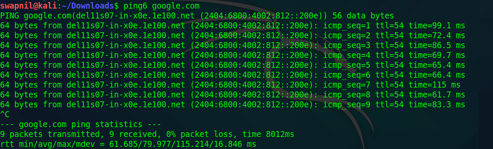
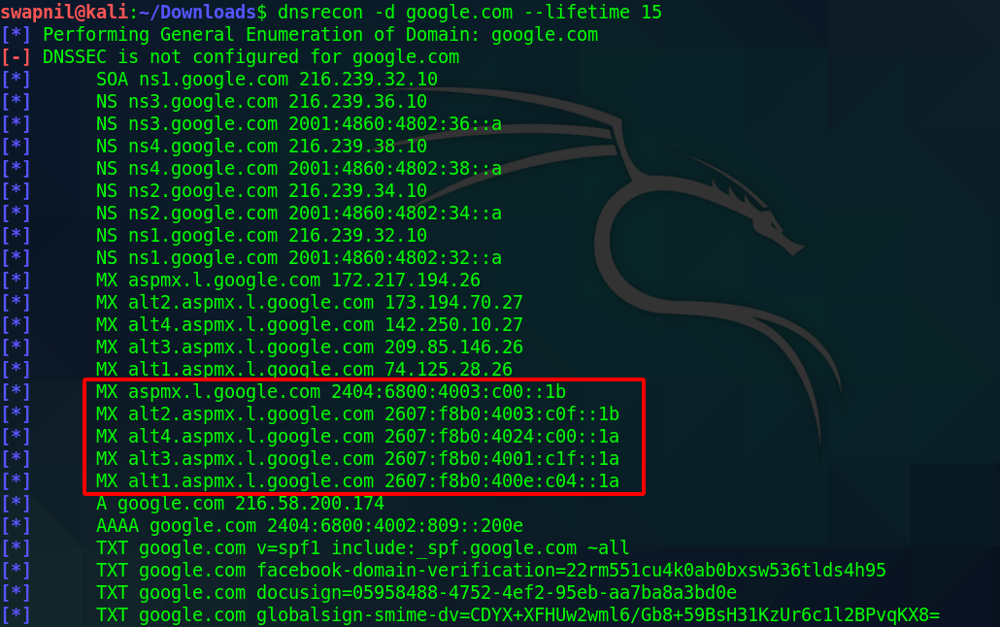
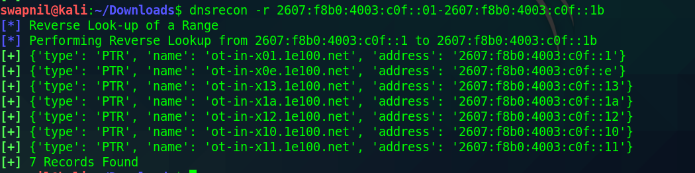
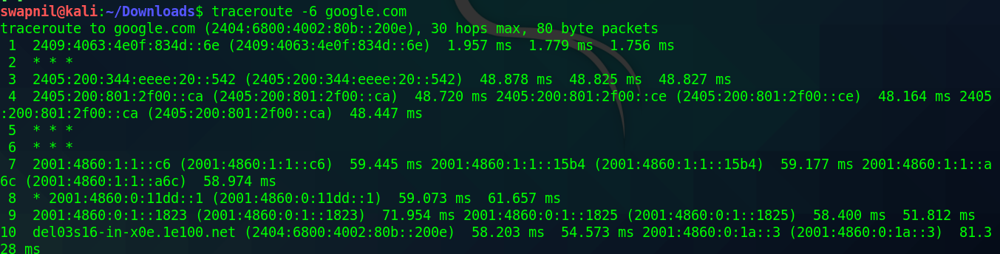
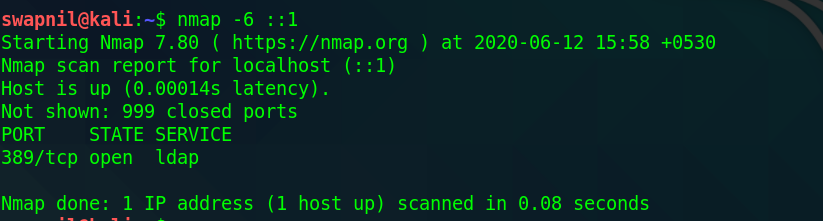
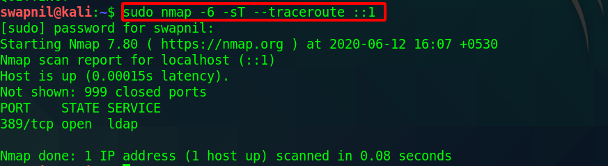
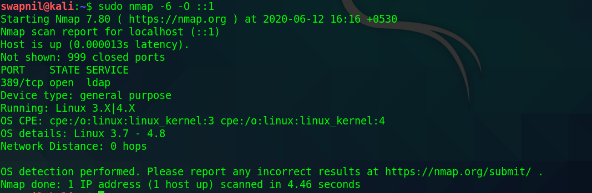
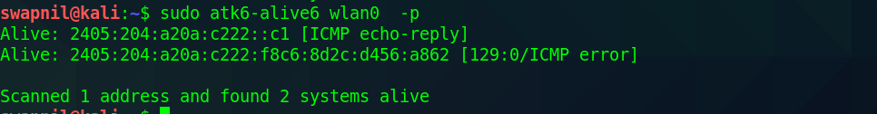
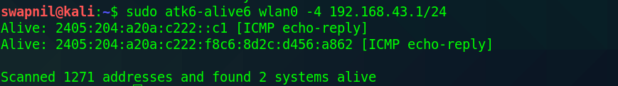

# IPV6 Enumeration

In an IPv6 address, the **first 48 bits are the network prefix**. The **next 16 bits are the subnet ID** and are used for defining subnets. The last **64 bits are the interface identifier** \(which is also known as the Interface ID or the Device ID, is for devices\). If necessary, the bits that are normally reserved for the Device ID can be used for additional subnet masking.

There is not ARP in IPv6. Instead, there is **ICMPv6 NS \(Neighbor Solicitation\) and NA \(Neighbor Advertisement\)**. The **NS** is used to resolve and address, so it sends **multicast** packets. The **NA** is **unicast** as is used to answer the NS. A NA packet could also be sent without needing a NS packet.

**0:0:0:0:0:0:0:1** = 1  – This is 127.0.0.1 equivalent in IPv4.

### Find IPV6 address of the host

```text
host -t AAAA domain_name
```


### Ping6

Regular ping command only works with IPv4 address. Use **ping6** command to send ICMPv6 ECHO\_REQUEST packets to network hosts from a host or gateway. This command uses the ICMPv6 protocol’s mandatory ICMP6\_ECHO\_REQUEST datagram to elicit an ICMP6\_ECHO\_REPLY from a host or gateway. ICMP6\_ECHO\_REQUEST datagrams \(pings\) have an IPv6 header, and ICMPv6 header formatted as documented in RFC2463. The ping6 command available on Linux, BSD, Apple OS X and other Unix-like operating systems. MS-Widows user can use ping -6 command as described here.

```text
#for windows
ping -6 domain_name or ip
#for linux
ping6 domain_name or ip
```



### DNSRecon

This script provides the ability to perform:

* Check all NS Records for Zone Transfers.
* Enumerate General DNS Records for a given Domain \(MX, SOA, NS, A, AAAA, SPF and TXT\).
* Perform common SRV Record Enumeration.
* Top Level Domain \(TLD\) Expansion.
* Check for Wildcard Resolution.
* Brute Force subdomain and host A and AAAA records given a domain and a wordlist.
* Perform a PTR Record lookup for a given IP Range or CIDR.
* Check a DNS Server Cached records for A, AAAA and CNAME Records provided a list of host records in a text file to check.



#### Getting Deeper



### Traceroute6

traceroute tracks the route packets taken from an IP network on their way to a given host. It utilizes the IP protocol's time to live \(TTL\) field and attempts to elicit an ICMP TIME\_EXCEEDED response from each gateway along the path to the host.

```text
traceroute -6 hostname
```



## Network scanning / Port Scanning

### Nmap

Scan the IPv6 address representing the localhost \(`::1`\):



The argument `-6` tells Nmap to perform IPv6 scanning. You can basically set any other flag in combination with `-6`. It supports scanning techniques using raw packets, service detection, TCP port and ping scanning, and the Nmap scripting engine.



**OS detection** for IPv6 addresses works in a similar way to that for IPv4; probes are sent and matched against a fingerprint database.




### Alive6

If we want to discover which hosts are alive in an IPv6 environment, we can't just ask the tool to scan the whole network because of the huge address space. Suppose, we machines have a 64-bit network range. If we discover the host it will be 2^64. There is a protocol called ICMPv6 Neighbour Disclovery. This protocol allows an IPv6 host to discover the link-local and autoconfigured addresses of all other IPv6 systems on the local network.\(used to find a live host on the local network\).

Alice6 identifies the active IPv6 enabled systems by sending an ICMPv6 probe and then listen to the responses.  
Syntax:

```text
atk6-alive6 interface [option]
```

Suppose we want to scan local IPv6 network to find the active system

```text
atk6-alive6 wlan0 -p
```



* "-4" option used to search for live hosts using an entire IPv4 subnetwork using CIDR block.




