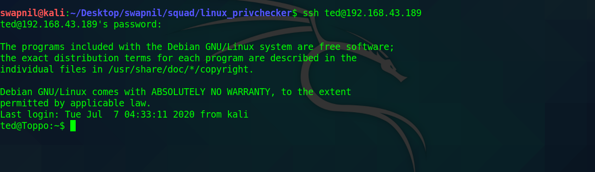
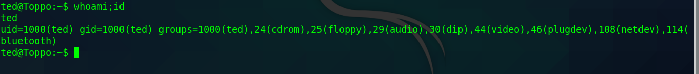
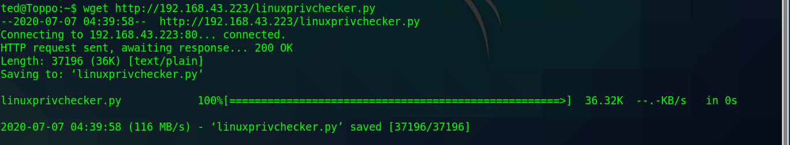
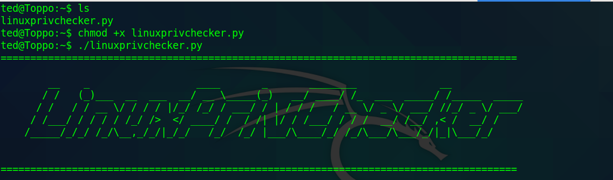
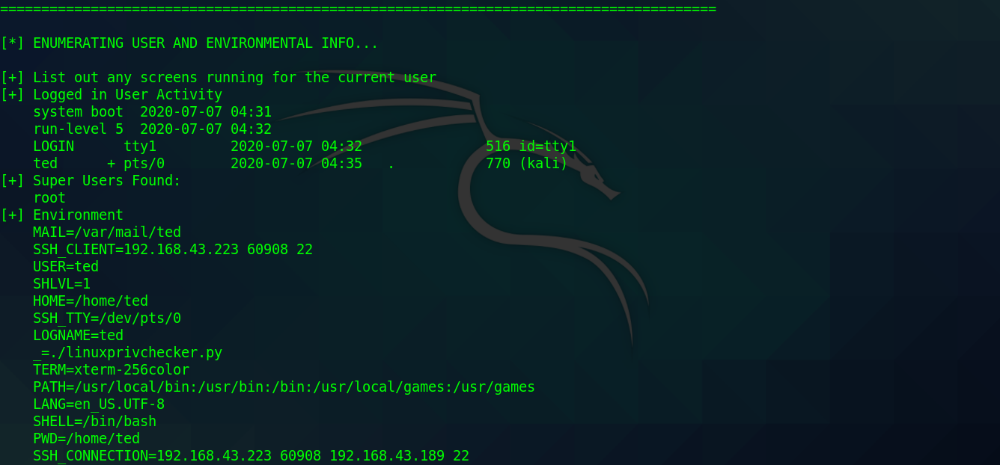
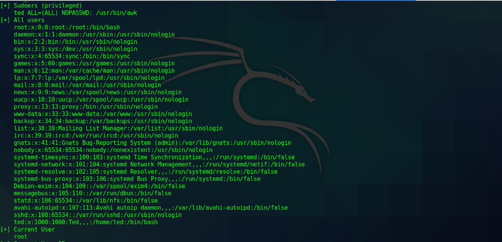
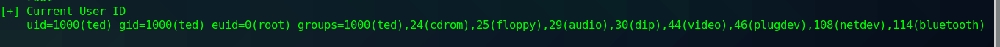
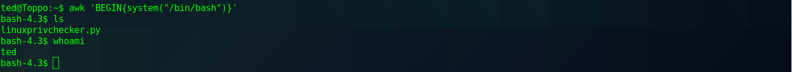
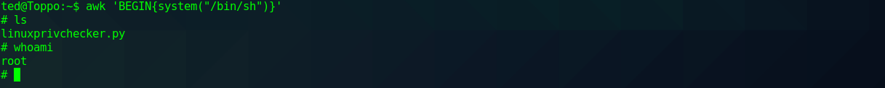

# Linuxchecker

### Linux privilege checker

Linux privilege checker is an enumeration tool with privilege escalation checking capabilities. You can download it using the wget command as follows:

```text
wget http://www.securitysift.com/download/linuxprivchecker.py

```

Let's start with the Exploitation.

There is a target machine whose IP is [http://192.168.43.189/](http://192.168.57.104/) 



Take the ssh of the machine: whose userId is `ted` and password is `12345ted123`

As, observed user is not **root**.



For privilege escalation I'm using `Linux privilege checker` script.

Host the script and download using `wget` 



### Overview of this Linux privilege escalation script identified:

* Basic system info \(OS/Kernel/System name, etc\)
* Networking Info \(ifconfig, route, netstat, etc\)
*  Miscellaneous filesystem info \(mount, fstab, cron jobs, etc\)
* User info \(current user, all users, super users, command history, etc\) 
* File and Directory permissions \(world-writeable files/dirs, suid files, root home directory\) 
* Files containing plaintext passwords
* Interesting files, processes and applications \(all processes and packages, all processes run by root and the associated packages, sudo version, apache config file, etc\) 
* All installed languages and tools \(gcc, perl, python, nmap, netcat, wget, ftp, etc\) 
* All relevant privilege escalation exploits \(using a comprehensive dictionary of exploits with applicable kernel versions, software packages/processes, etc\)

Run the script `./linuxprivchecker.py`









### For root access :

**Root using awk :**

**/bin/bash** didnot give root as it has privelege esacaltion protection



Let's try with _**/bin/sh**_

* Since _**/bin/sh**_ has no privilege escalation protection we get **root** access


