# MITM

### ARP Spoofing

Address Resolution Protocol \(ARP\) is a protocol that enables network communications to reach a specific device on the network. ARP translates Internet Protocol \(IP\) addresses to a Media Access Control \(MAC\) address, and vice versa. Most commonly, devices use ARP to contact the router or gateway that enables them to connect to the Internet.

ARP is the Address Resolution Protocol. It is used to resolve IP addresses to physical MAC \(media access control\) addresses in a local area network. When a host needs to talk to a host with a given IP address, it references the ARP cache to resolve the IP address to a MAC address. If the address is not known, a request is made asking for the MAC address of the device with the IP address.

An attacker wishing to pose as another host could respond to requests it should not be responding to with its own MAC address. With some precisely placed packets, an attacker can sniff the private traffic between two hosts. Valuable information can be extracted from the traffic, such as exchange of session tokens, yielding full access to application accounts that the attacker should not be able to access.


* Enabling port forwarding 


* Select the Network interface as appropriate, in this case, it is wlan0, click on **OK**

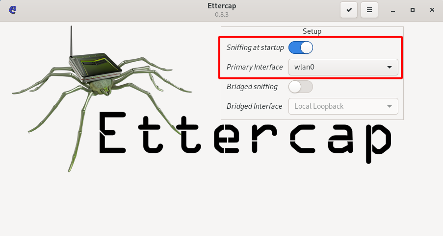

* Check the ip of the target machine

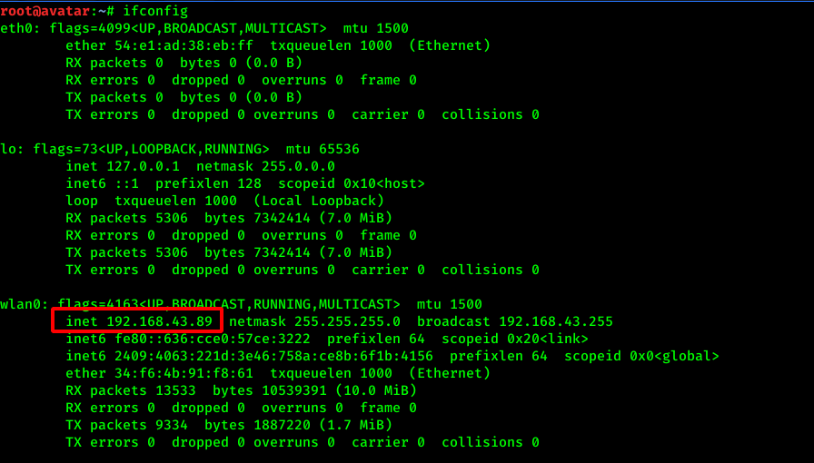

* Select the Target &gt;&gt; Current Target

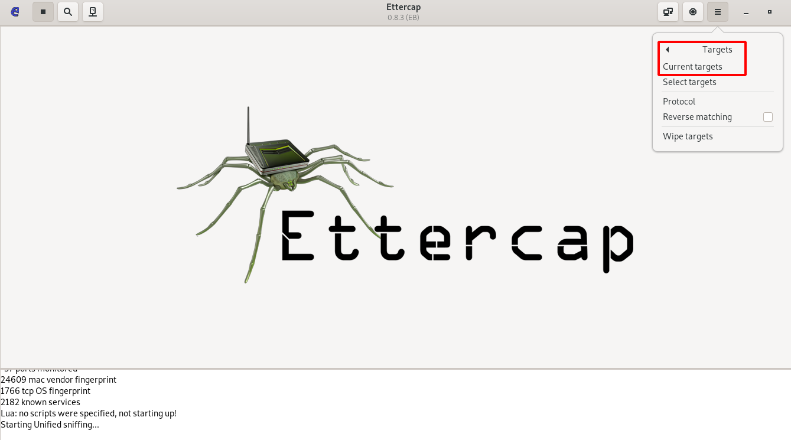

* Enter the Gateway IP of the target which is 192.168.43.1in Target 1 and in Target 2 assign the target IP

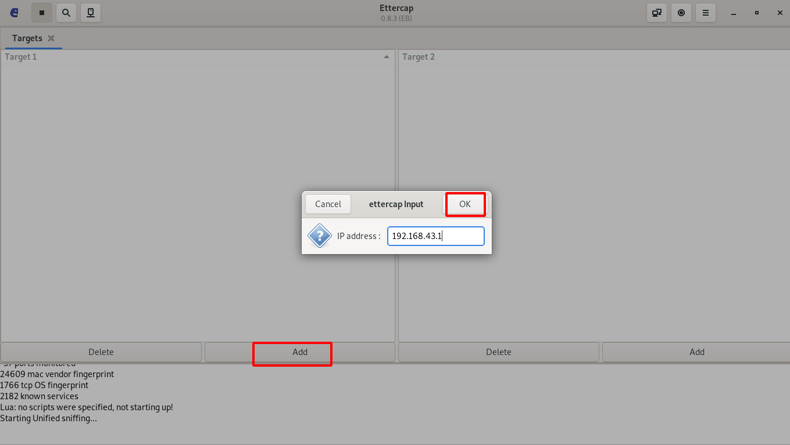

* Click on MITM attack: arp spoofing and select sniff remote connections

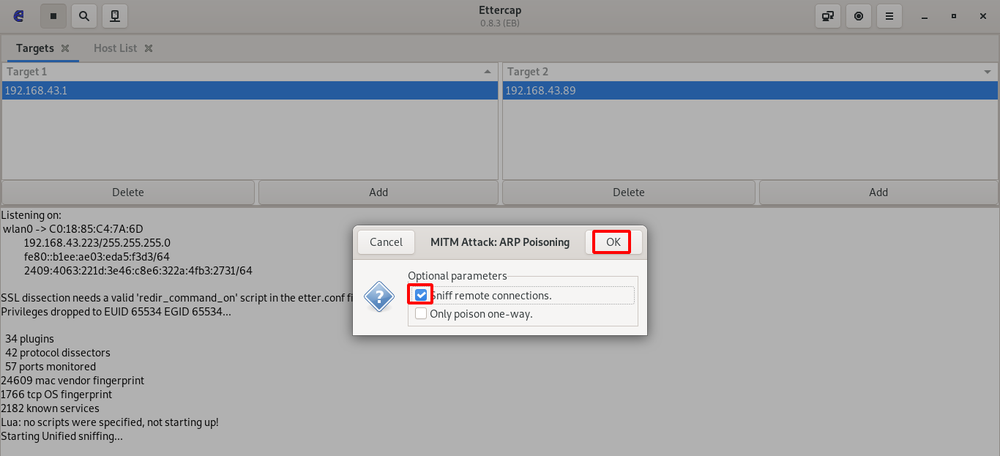

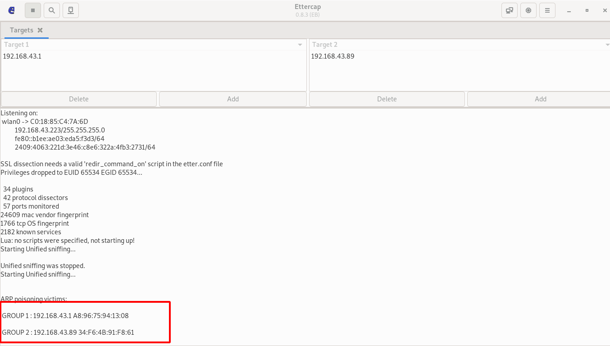

* We can analyze the traffic using tcpdump.

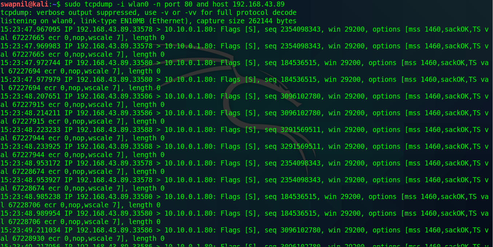


### How to Detect an ARP Cache Poisoning Attack

Here is a simple way to detect that a specific device’s ARP cache has been poisoned, using the command line. Start an operating system shell as an administrator. Use the following command to display the ARP table, on both Windows and Linux:

```text
arp -a
```

The output will look something like this:

```text
Internet Address    Physical Address

192.168.5.1        00-14-22-01-23-45
192.168.5.201      40-d4-48-cr-55-b8
192.168.5.202      00-14-22-01-23-45
```

If the table contains two different IP addresses that have the same MAC address, this indicates an ARP attack is taking place. Because the IP address 192.168.5.1 can be recognized as the router, the attacker’s IP is probably 192.168.5.202.

To discover ARP spoofing in a large network and get more information about the type of communication the attacker is carrying out, you can use the open source Wireshark protocol.

### ARP Spoofing Prevention

Here are a few best practices that can help you prevent ARP Spoofing on your network:

* **Use a Virtual Private Network \(VPN\)**⁠—a VPN allows devices to connect to the Internet through an encrypted tunnel. This makes all communication encrypted, and worthless for an ARP spoofing attacker.
* **Use static ARP**⁠—the ARP protocol lets you define a static ARP entry for an IP address, and prevent devices from listening on ARP responses for that address. For example, if a workstation always connects to the same router, you can define a static ARP entry for that router, preventing an attack.
* **Use packet filtering**⁠—packet filtering solutions can identify poisoned ARP packets by seeing that they contain conflicting source information, and stop them before they reach devices on your network.
* **Run a spoofing attack**⁠—check if your existing defenses are working by mounting a spoofing attack, in coordination with IT and security teams. If the attack succeeds, identify weak points in your defensive measures and remediate them.

## ARP spoofing using arpspoof <a id="arp-spoofing-using-arpspoof"></a>

Now, check out how to run an actual ARP poisoning attack, redirect the flow of packets, and make it flow through your device. This section will talk about a tool called `arpspoof`, which is part of a suite called `dsniff`.

The `dsniff` suite contains a number of programs that can be used to launch MITM attacks. You’ll see how to use it to carry out ARP poisoning, which redirects the flow of packets through your device. The `arpspoof` tool is old but still works, and because it’s so simple, it’s been ported to Android, iOS, and other smaller operating systems.

To get started, connect to the target network using the arpspoof tool. Here, it’s going to be `arpspoof -i`, as you need to choose your internet card \(virtual card\), which is `wlan0`. Now insert the target IP address. Here, your target is a Windows device, with IP, `192.168.43.89`.

Now insert the IP address for the access point, which is `192.168.43.1`. You’ll tell the access point that the client IP address has your MAC address, so basically, you’ll tell the access point that you are the target client:

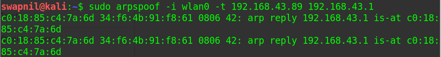

After this, you’ll have to run arpspoof again, and instead of telling the access point that you are the target client, you’ll tell the client that you are the access point. So you’ll need to flip the IPs:

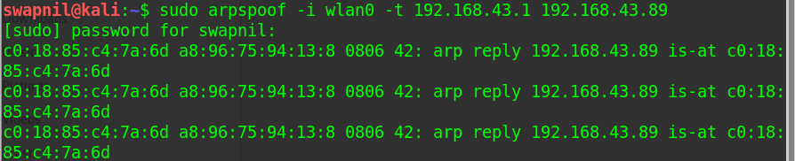

By running the above commands you’ll fool the access point and the client, and you’ll let the packets flow through your device. Since Windows is the target device, you’ll use the ARP table. So, if you run the arp  command in the Linux machine, it will show you the ARP table.

Now, once you perform the attack, you’ll see that the MAC address `c0:18:85:c4:7a:6d` for the target access point will change and it will be the attacker’s MAC address


Enable the IP forwarding. We do that so that when the packets flow through our device, they don't get dropped so that each packet that goes through our device gets actually forwarded to its destination. So, when we get a packet from the client, it goes to the router, and when a packet comes from the router, it should go to the client without being dropped in our device. So, we're going to enable it using this command: `echo 1 > /proc/sys/net/ipv4/ip_forward`

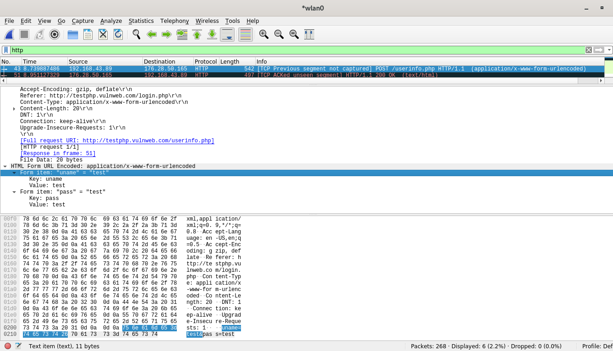


### MITM using Arpspoof, Urlsnarf, driftnet

* First step is setting up arpspoof between victim and router.

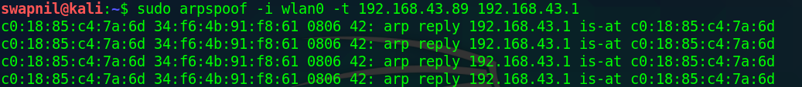

* Setting up arpspoof from to capture all packet from router to victim.

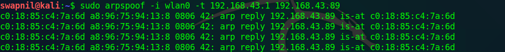

* Now, all the packet sent or received by victim should be going through attacker machine.
* Run driftnet, we just run this

  > driftnet -i wlan0


* When victim browse a website with image, driftnet will capture all image traffic as shown in the screenshot below.

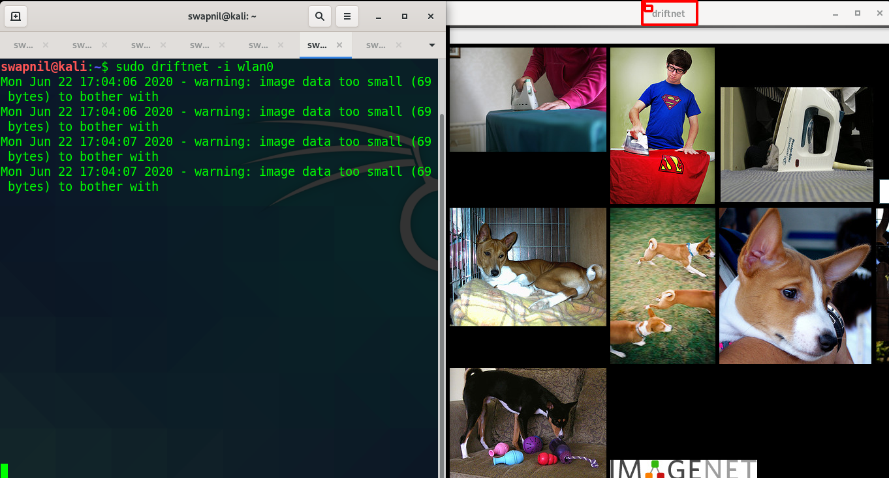

* Try to capture the website information/data by using urlsnarf. To use urlsnarf, just run this code

  > urlsnarf -i wlan0


* When victim browse a website, attacker will know the address victim visited.

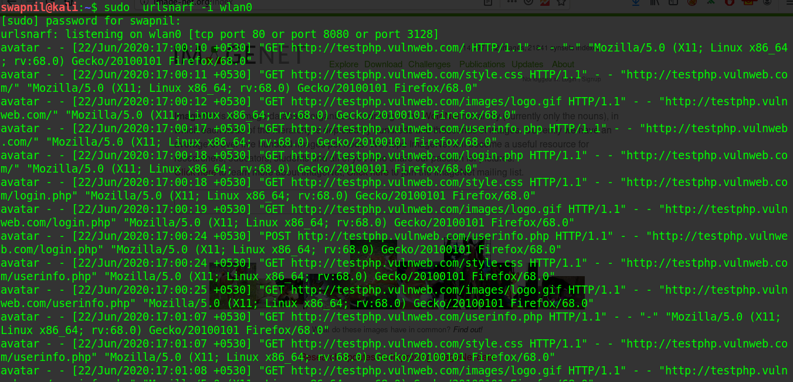

