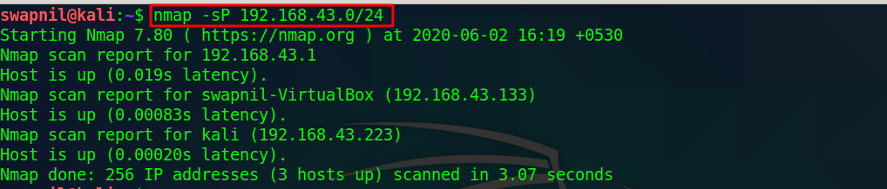
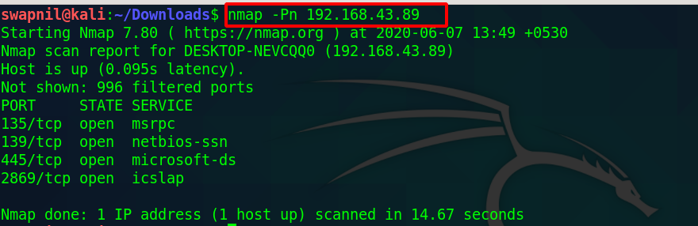
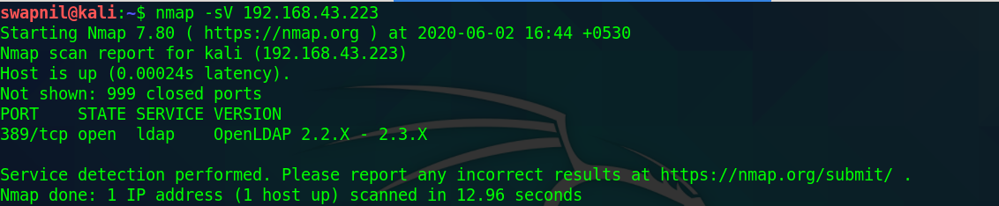
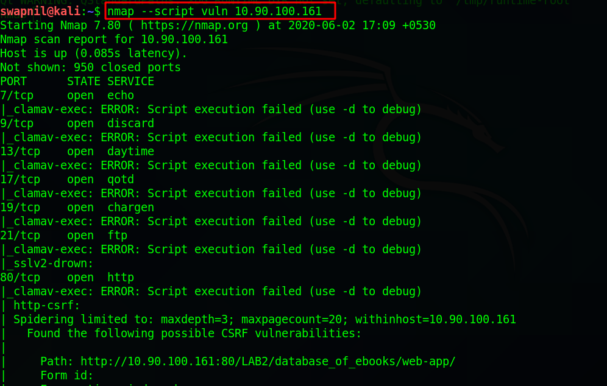
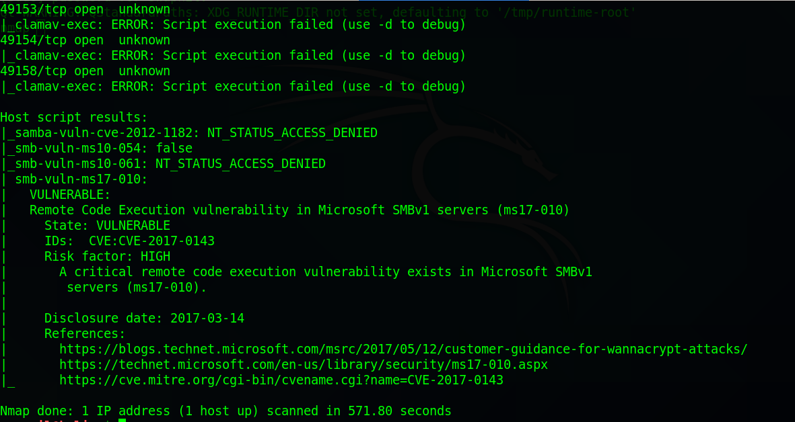
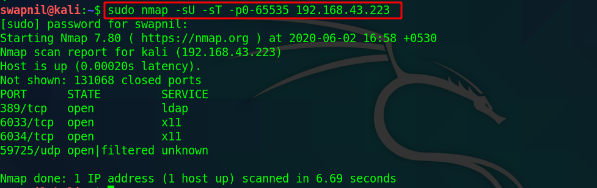
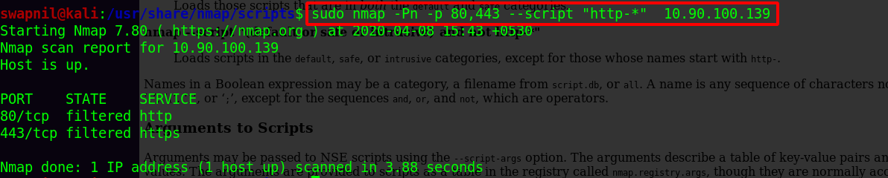
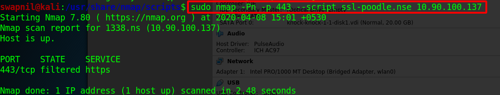
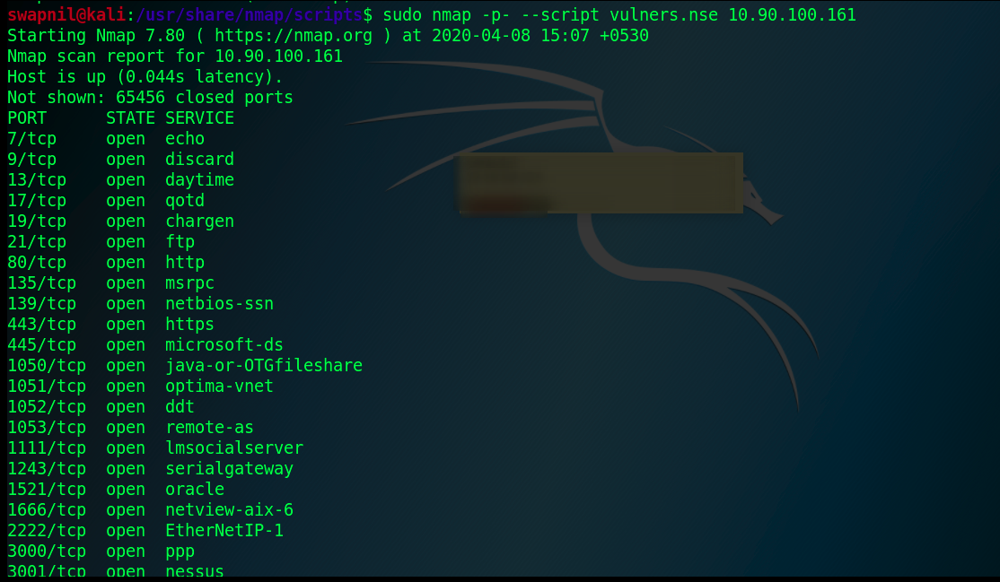

# Task 3 - Nmap

### Host Detection

```text
nmap -sP ip
#sP Only Discovery
```



### No Ping Scan

```text
nmap -Pn ip
```



### Service Version Scan

```text
nmap -sV ip
```



### All Scan

```text
nmap --script vul ip
```





### TCP&UDP scan

```text
nmap -sU -sT -p0-65535 ip
```



### Script Engine

#### HTTP



#### Poodle



#### Vulner script



