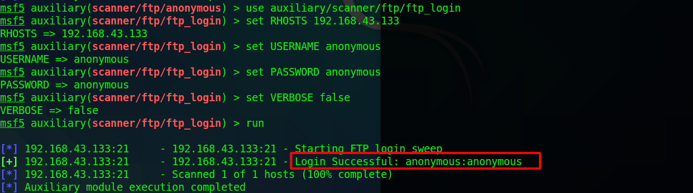
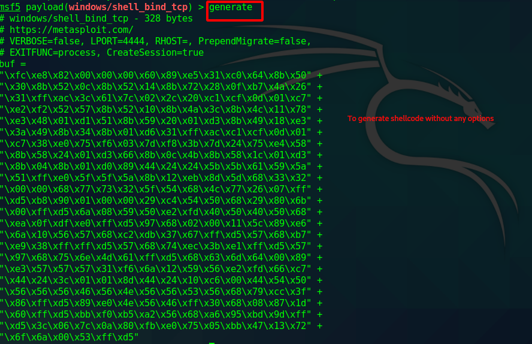

# Task 5 - Metasploit

### Auxiliary Demo

### Exploit Demo

This module exploits the Shellsock vulnerability, a flaw in how the Bash shell handles external environment variables. This module targets CGI scripts in the Apache web server by setting the HTTP\_USER\_AGENT environment variable to a malicious function definition.

Set the RHOST, TARGETURI and payload. Furthermore, we need to set  LHOST address to the IP address of your machine.

### Payload and types of payloads

[https://www.offensive-security.com/metasploit-unleashed/payloads/](https://www.offensive-security.com/metasploit-unleashed/payloads/)

### Create Payloads

### Exploit and its types



### Reverse shell

**Bind Shells**

Bind shells have the listener running on the target and the attacker connect to the listener in order to gain a remote shell.

**Reverse Shells**

Reverse shells have the listener running on the attacker and the target connects to the attacker with a shell.

### Bind shells

### Use the database

