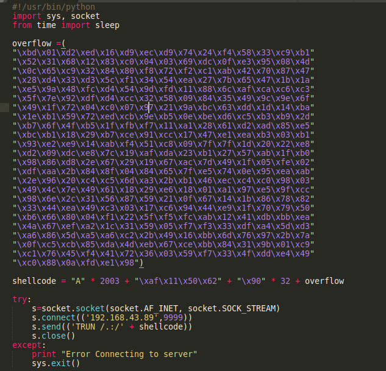

# Task 7 - BufferOverflow

### Overwriting the stack remotely

Load the vulnserver into Immunity Debuuger

Spiking 

### Calculate the location of overwriting

### Identify the bad chars

Certain byte characters can cause issues in the development of exploits. We must run every byte through the Vulnserver program to see if any characters cause issues. By default, the null byte\(x00\) is always considered a bad character as it will truncate shellcode when executed. To find bad characters in Vulnserver, we can add an additional variable of “badchars” to our code that contains a list of every single hex character

So, let’s again close/re-open Vulnserver and Immunity Debugger and send this bad boy off. Once you have sent the exploit, you will need to right click on the ESP register and select “Follow in Dump”. You should notice a little bit of movement in the bottom left corner of the program. If you look carefully, you should see all of your bytes in order starting with 01, 02, 03, etc and ending with FF. If a bad character were present, it would seem out of place. Luckily for us, there are no bad characters in the Vulnserver program. Notice below how all of our numbers appear perfect and in order:

Examine this picture below and see if you can identify the bad characters:

### JMP ESP Technique

### Exploit 

Create a shell code  
As you can see, we generated 351 bytes of shellcode. We need to copy/paste this shellcode into our Python script. 

Here is what my final script looks like:

 on designated port

Run the python script

Gain the shell

