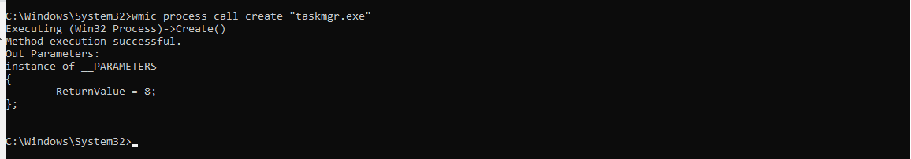

# Wmic\(Windows Management Instrumentation Command Line\)

 WMI is a set of extensions to the Windows Driver Model that provides an OS interface where components can provide information and notifications. The WMI classes Win32\_Process can help collect useful information about processes. The Windows command wmic extends WMI for operation from several command-line interfaces and through batch scripts without having to rely on any other programming language. The command wmic uses class aliases to query related information. It can be executed remotely as well as locally by specifying target node or host name and credentials. 

When an Attacker gains a meterpreter session on a Remote PC, then he/she can enumerate a huge amount of information and make effective changes using the WMI Command Line.

To do this, we will first get the meterpreter session on the Remote PC. After gaining the session, escalate its privilege to Administrator.

#### WMIC

`wmic /?`


#### **Get System Roles, User Name, and Manufacturer**

We can enumerate lots of information about the Victim System including its Name, Domain, Manufacturer, Model Number and Much more through the computer system alias of wmic command.

We are adding the following filters to get a specific result.

**Roles**: It gives all the roles that the victim system play like Workstation, Server, Browser etc.

**Manufacturer**: It gives the manufacturer of the system, sometimes there are certain vulnerabilities in a particular model of a particular model. So we can use this information to search for any direct vulnerabilities.

**UserName: It gives the username of the system which is proven very helpful as we can differentiate between administrators and normal users**

**\[/format: list\]: To sort the output in a list format.**

```text
wmic computersystem get Name, domain, Manufacturer, Model, Username, Roles /format:list
```


#### **Get the SIDs**

To enumerate these SIDs we will use group alias of wmic.

```text
wmic group get Caption, InstallDate, LocalAccount, Domain, SID, Status
```

As shown in the below image here we have found the Account Name, Domain, Local Group Member status, SID and their status.


#### **Create a process**

We can create many processes on the victim’s system using the process alias of wmic command.

This is helpful in running any backdoor or fill up the memory of the victim’s system.

**Syntax:** `wmic process call create “[Process Name]”`

```text
wmic process call create "taskmgr.exe"
```

**Note:** if the process creates a window like Task Manager, cmd, etc. then this command will open up that window on the victim’s system and create suspicion in the mind of the victim.



#### **Change Priority of a Process**

We can change the priority of any process running on the victim’s system with the help of process alias of wmic command.

This is an important feature because it can be used to manipulate processes as we can increase the priority of any process of our choice or decrease the priority of any process. Decreasing the priority of any process can result in the crashing of that particular application and increasing may crash the overall system.

```text
wmic process where name="explorer.exe" call setpriority 64
```


#### **Get a list of Executable Files**

We can get a list which contains the location of the executable files other than that of windows.

```text
wmic PROCESS WHERE "NOT ExecutablePath LIKE ‘%Windows%’" GET ExecutablePath
```


#### **Locate System Files**

Extract paths of all the important system files like temp folder, win directory and much more.

```text
wmic environment get Description, VariableValue
```


#### **Get a list of Installed Applications**

We can get a list of applications or software installed on the victim’s system

```text
wmic product get name
```


#### **Get a list of Running Services**

We can fetch the list of services which are running and services which start automatically or not.

```text
wmic service where (state="running") get caption, name, startmode, state
```


#### **Get Startup Services**

We can enumerate startup services using startup alias for all the services that run during the windows startup.


#### **Get System Driver Details**

We can enumerate Driver Details like Name, Path and Service Type using the **sysdrive alias.**

This command gives the path of the driver file, its status \(Running or Stopped\), Its Type \(Kernel or File System\)

```text
wmic sysdriver get Caption, Name, PathName, ServiceType, State, Status /format:list
```


#### **Get the Motherboard Details**

We can use the **baseboard alias** of the wmic command line to enumerate the motherboard details of the victim’s system. Things we can enumerate are Motherboard Manufacturer, Serial Number, and Version

```text
wmic baseboard get Manufacturer, Product, SerialNumber, Version
```


#### **Get BIOS Serial Number**

We can use the **bios alias** of the wmic command line to enumerate the bios details of the victim’s system.  


```text
wmic bios, get serialNumber
```


#### **Get Antivirus Details**

We can enumerate the antivirus installed on the victim’s system along with its location and version.


#### **Clear System Logs**

Wmic can be used to delete system logs using the **nteventlog alias**. It is a very simple command where we mention the name of the log and then using an option nteventlog and clear the log file. It can be an effective command while cleaning up after hacking any system.

**Syntax:** wmic nteventlog where filename='\[logfilename\]’ cleareventlog

```text
wmic nteventlog where filename='system' call cleareventlog
```


